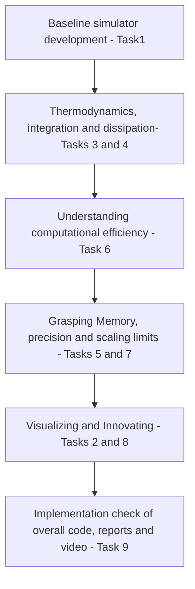

# Toy Model for exploring Molecular interactions:
## Objectives:
The project aims to develop a basic model of motion of particles in 2D and a 3D container of fixed dimensions. It doesn't take into account full-scale Molecular
Dynamics but provides a foundational idea of how modelling atoms works.
## Project_Flowchart:
The project has been split into the following steps with each part allocated to a member of the team.

