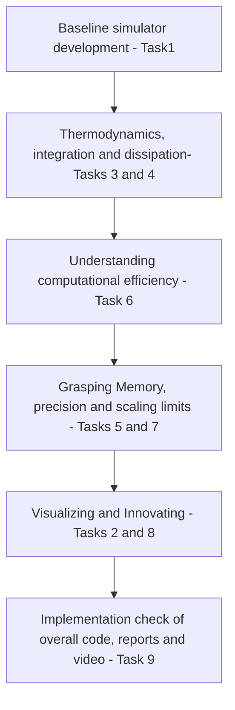

# My_FOSC_Project

```mermaid
graph TD
    A[Baseline simulator development - Task1] --> B[Thermodynamics, integration and dissipation- Tasks 3 and 4]
    B --> C[Understanding computational efficiency - Task 6]
    C --> D[Grasping Memory, precision and scaling limits - Tasks 5 and 7]
    D --> E[Visualizing and Innovating - Tasks 2 and 8]
    E --> F[Implementation check of overall code, reports and video - Task 9]
```
